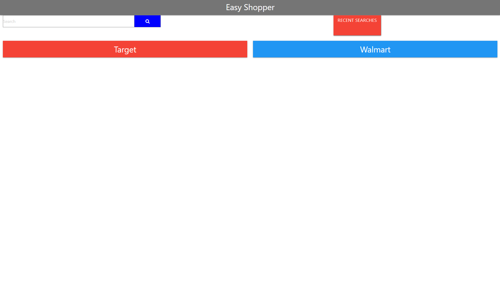

Description:

This app is for anyone who is in the market to purchase an item that they don't know much about. It is designed to pull up highly-rated and relevant products from Target and Amazon to make shopping easier.

Usage Instructions:

Type in a product that you are interested in in the search bar, and relevant information will appear on both the Target and Amazon columns. Search history is appended to the search history button and saved with local storage, so users can easily return to previous searches. Links to the products are also provided.

Links:

[Repository:](https://github.com/ShueMoua/Price-Comparison-App)

[Easy Shopper:](https://shuemoua.github.io/Price-Comparison-App/)

Thanks to Ravi Knutson, Elijah Flanders, and Shuelong Moua for all working hard on this project together.
